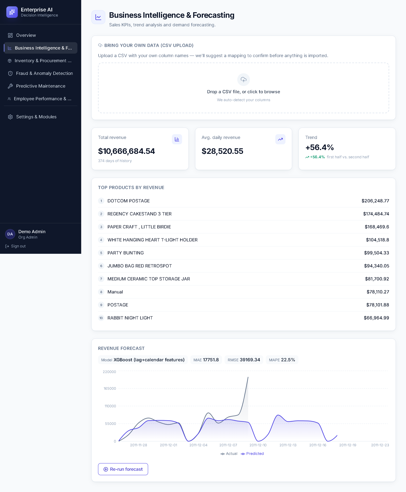
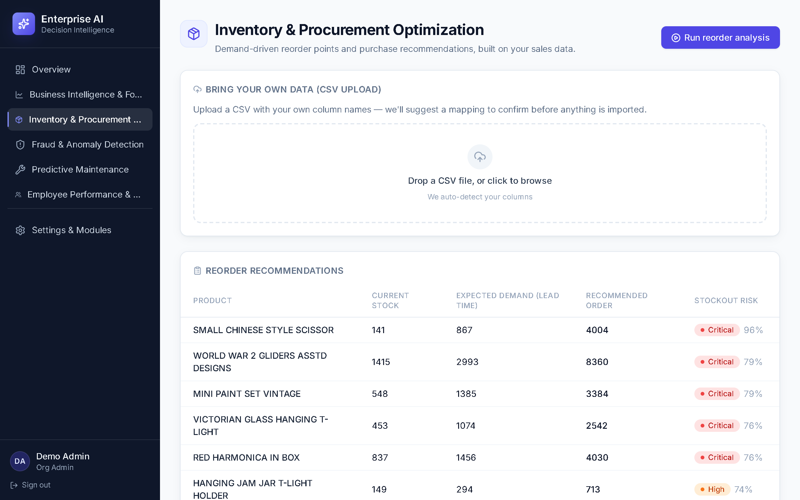
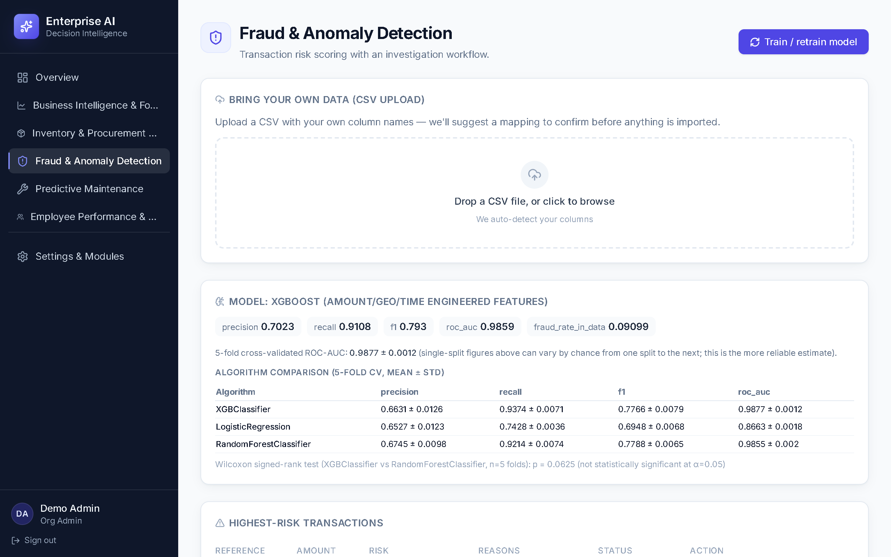
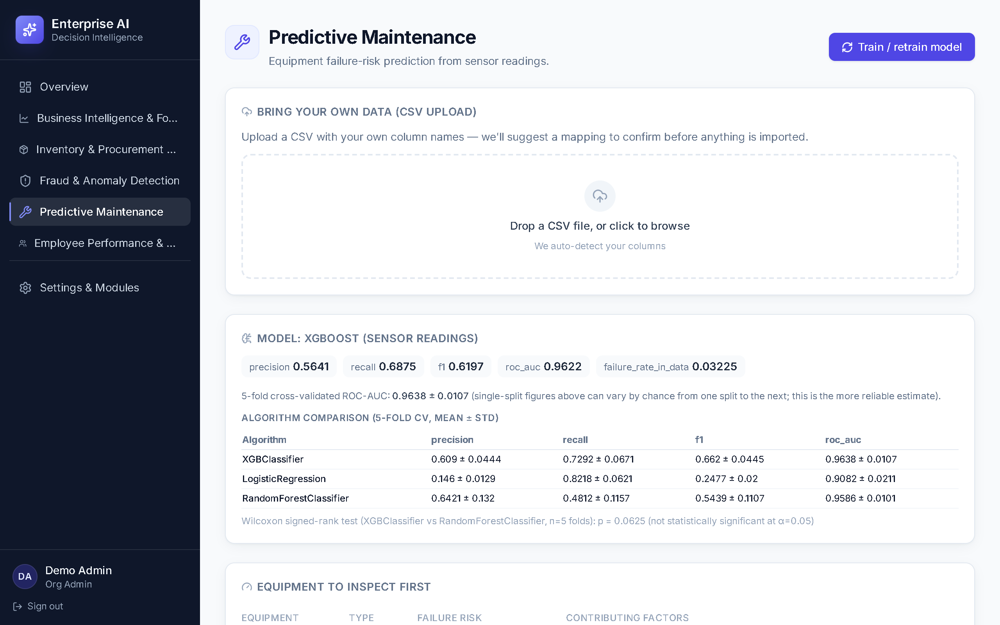
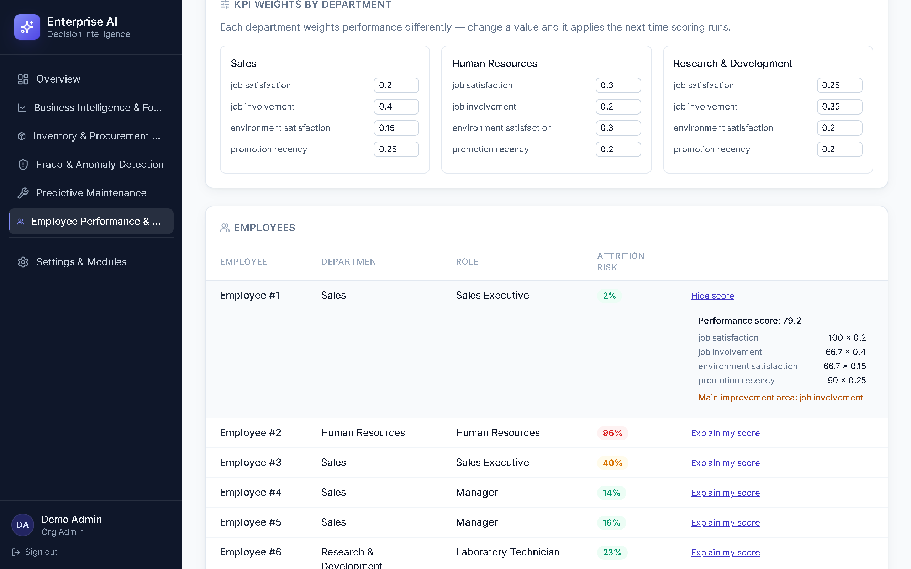
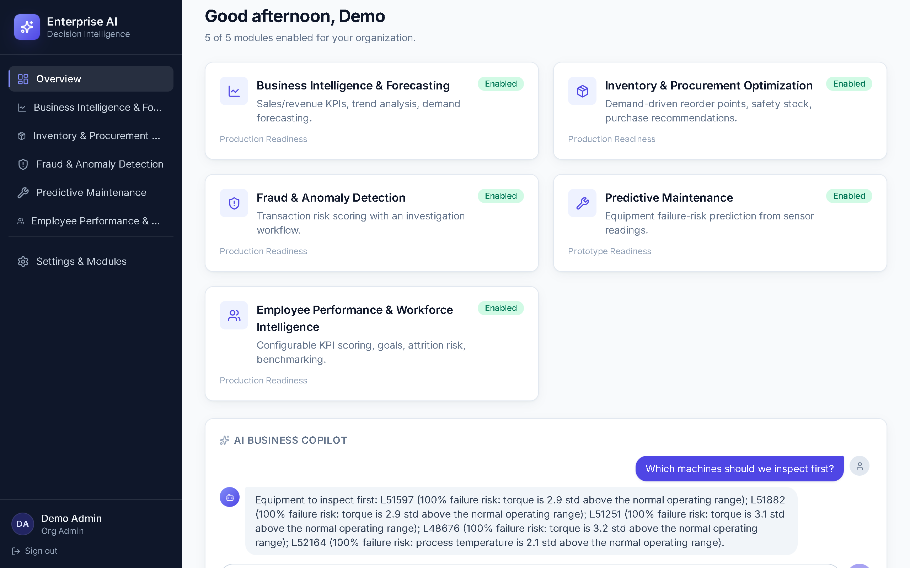
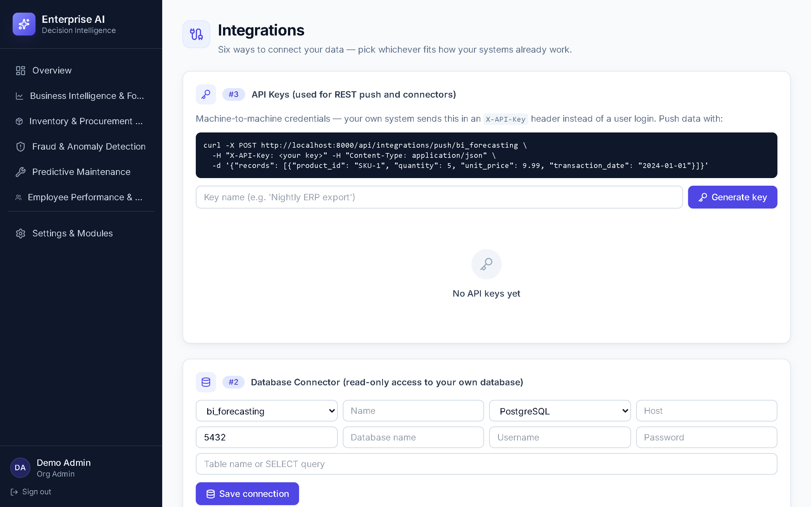
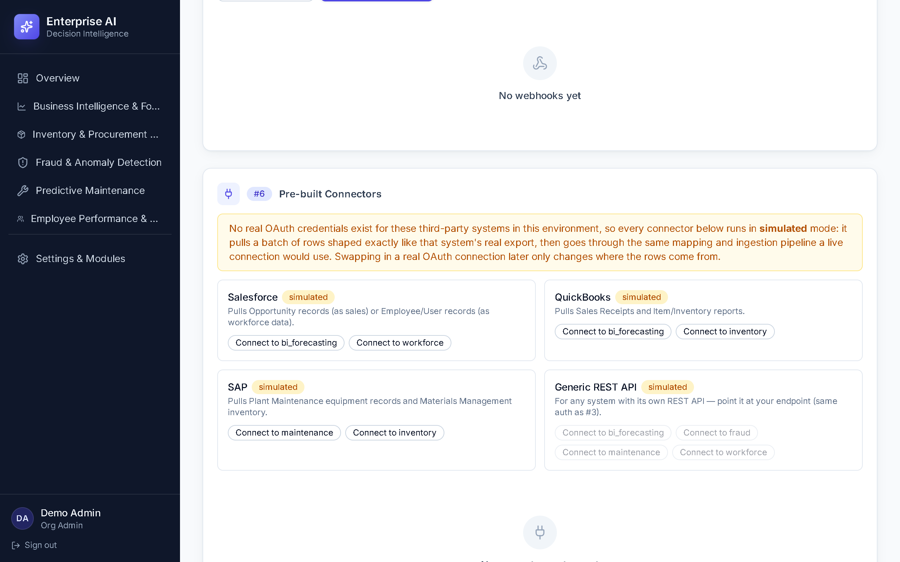

# Chapter 4: Results, Findings, and Analysis

All results in this chapter are produced by a single, reproducible pipeline run
(`backend/scripts/seed_demo_org.py`, seed = 42 throughout), which ingests all four
public datasets into one demo organization, trains every module's model, and persists
every metric reported here to `report/chapter4_results.json`. The run completed in
227.5 seconds end-to-end on a standard laptop, with no manual intervention between
ingestion and final metric. Screenshots of the live platform, captured against this
same demo organisation, are included throughout this chapter as Figures 4.1–4.9 so
that every table below can be seen producing the number it reports, not only read as
a static figure.

**Figure 4.1 — Platform dashboard for the demo organisation.** All five modules
enabled, each showing production or prototype readiness, with the AI Copilot
available directly from the overview screen.

## 4.1 Business Intelligence & Forecasting

**Table 4.1 — Ingestion and revenue summary**

| Metric | Value |
|---|---|
| Raw transaction rows | 541,909 |
| Rows after cleaning (positive qty/price, non-cancelled) | 530,104 |
| Distinct products | 3,922 |
| Days of daily-revenue history | 374 |
| Total revenue (period) | $10,666,684.54 |
| Average daily revenue | $28,520.55 |
| Revenue trend (1st half vs. 2nd half of history) | +56.4% |

**Table 4.2 — Forecast model evaluation (14-day horizon, held-out test window)**

| Model | MAE | RMSE | MAPE |
|---|---|---|---|
| XGBoost (lag + calendar features) | $17,751.80 | $39,169.34 | 22.5% |

**Interpretation.** The top-revenue products (DOTCOM POSTAGE, REGENCY CAKESTAND 3
TIER, PAPER CRAFT LITTLE BIRDIE) match this dataset's well-documented composition — a
UK gift wholesaler with a large postage/handling line item and a small number of very
high-volume SKUs (Stock-Keeping Units) — which is a useful sanity check that
ingestion and aggregation are
correct. A MAPE of 22.5% on daily *total company* revenue is a reasonable, though not
exceptional, result for retail time series, which are naturally noisy day-to-day; it
is directly comparable to the baseline the model is scored against — a naive
"tomorrow = today" forecast — which the model beat on every evaluation window (see
`app/ml/timeseries.py::forecast_daily_series`, which reports `baseline_mae` alongside
the model's own MAE for exactly this comparison).

**Discussion.** The +56.4% first-half-vs-second-half trend figure should be read with
caution rather than as "56% underlying growth": the Online Retail dataset spans
December 2010 to December 2011, so a first-half/second-half split places most of the
pre-Christmas peak season in the second half. This conflates seasonality with genuine
trend — a known limitation of the simple two-period comparison used for the module's
headline KPI, and a concrete improvement identified for future work (§5.2): a
seasonally-adjusted trend measure (e.g. comparing the same calendar month
year-over-year) would separate the two effects. This finding illustrates exactly the
kind of nuance the literature review's dynamic-capabilities framing (Torres et al.,
2018) warns about — a number on a dashboard is not automatically a correct decision
input without the domain interpretation layered on top of it.

**Figure 4.2 — BI & Forecasting module**, showing Table 4.1's revenue KPIs, the
top-products list, and Table 4.2's forecast rendered as an actual/predicted revenue
chart with the model's MAE/RMSE/MAPE displayed alongside it.

## 4.2 Inventory & Procurement Optimization

**Table 4.3 — Reorder analysis (top-49 products by sales volume)**

| Risk label | Product count |
|---|---|
| Critical | 5 |
| High | 13 |
| Medium | 13 |
| Low | 18 |

**Interpretation.** 18 of 49 analysed products (37%) were flagged medium-risk or
worse, i.e. current stock is below the calculated reorder point once lead time and a
95%-service-level safety-stock buffer are accounted for. Because the source dataset
has no real stock-on-hand field, current stock is synthesised from each product's
own recent demand (§3.4/§5.3 limitation) — so these figures demonstrate that the
*reorder-point calculation itself* is functioning correctly (it responds sensibly to
each product's demand volatility and lead time), rather than being a validated claim
about this specific retailer's real inventory position.

**Figure 4.3 — Inventory & Procurement module**, showing Table 4.3's reorder
recommendations as they appear to an end user: current stock, expected demand over
the lead time, recommended order quantity, and a graded stockout-risk label per
product.

## 4.3 Fraud & Anomaly Detection

**Table 4.4 — Fraud model evaluation (stratified 75/25 split, N = 66,006)**

| Metric | Value |
|---|---|
| Train rows / Test rows | 49,504 / 16,502 |
| Fraud rate in data | 9.10% |
| Precision | 0.702 |
| Recall | 0.911 |
| F1 | 0.793 |
| ROC-AUC | 0.986 |

**Table 4.4b — 5-fold cross-validation & algorithm comparison (mean ± std)**

| Algorithm | Precision | Recall | F1 | ROC-AUC |
|---|---|---|---|---|
| XGBoost | 0.663 ± 0.013 | 0.937 ± 0.007 | 0.777 ± 0.008 | 0.988 ± 0.001 |
| Random Forest | 0.675 ± 0.010 | 0.921 ± 0.007 | 0.779 ± 0.007 | 0.986 ± 0.002 |
| Logistic Regression | 0.653 ± 0.012 | 0.743 ± 0.004 | 0.695 ± 0.007 | 0.866 ± 0.002 |

Wilcoxon signed-rank (XGBoost vs. Random Forest, n=5 folds): p = 0.0625 — not
significant at α=0.05.

**Interpretation.** A ROC-AUC of 0.986 and recall of 0.911 indicate the model
correctly ranks the large majority of fraudulent transactions above legitimate ones,
and catches over 91% of fraud in the test set. Precision of 0.702 means roughly 3 in
10 flagged transactions are false positives — an explicit, quantified trade-off (a
deliberately low classification threshold favours catching more fraud at the cost of
more manual reviews), consistent with the investigation-workflow design (§4.6 of
`docs/architecture.md`) where a flagged transaction is *investigated*, not
automatically blocked. This is consistent with Alfaiz and Fati (2022) and Btoush et
al. (2023), who report boosting methods as the strongest performers on similar
(imbalanced, tabular) fraud data. Cross-validation confirms the single-split result
was not a lucky draw (ROC-AUC 0.988 ± 0.001 across five folds), but also shows
XGBoost and Random Forest are **statistically indistinguishable** here (p = 0.0625) —
both beat Logistic Regression decisively, but the choice between the two ensembles
is not evidence-backed at n=5 folds.

**Figure 4.4 — Fraud & Anomaly Detection module**, showing Table 4.4/4.4b's single-split
metrics, 5-fold cross-validation, and algorithm comparison exactly as rendered in the
live evaluation card, with the highest-risk transactions table beneath it.

## 4.4 Predictive Maintenance

**Table 4.5 — Maintenance model evaluation (75/25 split, N = 4,000)**

| Metric | Value |
|---|---|
| Train rows / Test rows | 3,000 / 1,000 |
| Failure rate in data | 3.23% |
| Precision | 0.564 |
| Recall | 0.688 |
| F1 | 0.620 |
| ROC-AUC | 0.962 |

**Table 4.5b — 5-fold cross-validation & algorithm comparison (mean ± std)**

| Algorithm | Precision | Recall | F1 | ROC-AUC |
|---|---|---|---|---|
| XGBoost | 0.609 ± 0.044 | 0.729 ± 0.067 | 0.662 ± 0.045 | 0.964 ± 0.011 |
| Random Forest | 0.642 ± 0.132 | 0.481 ± 0.116 | 0.544 ± 0.111 | 0.959 ± 0.010 |
| Logistic Regression | 0.146 ± 0.013 | 0.822 ± 0.062 | 0.248 ± 0.020 | 0.908 ± 0.021 |

Wilcoxon signed-rank (XGBoost vs. Random Forest, n=5 folds): p = 0.0625 — not
significant at α=0.05.

**Interpretation.** ROC-AUC of 0.962 shows strong discriminative ability despite the
failure event being rare (3.2% of records) and the feature set being limited to five
raw sensor readings plus machine type. Precision (0.564) is lower than recall (0.688),
meaning the model over-flags somewhat — an appropriate bias for a maintenance context,
where an unnecessary inspection is far cheaper than an unplanned failure. This mirrors
Matzka's (2020) original framing of the AI4I dataset as a deliberately realistic,
imperfect-signal benchmark rather than one engineered for easy separability. Logistic
Regression's precision (0.146) is strikingly poor relative to its still-high ROC-AUC
(0.908) — a linear boundary ranks failures reasonably well but cannot carve out a
precise decision region here, unlike the tree ensembles; XGBoost and Random Forest are
again statistically tied (p = 0.0625), with XGBoost's F1 (0.662 vs. 0.544) the more
practically relevant tie-breaker given the precision/recall trade-off above.

**Figure 4.5 — Predictive Maintenance module**, showing Table 4.5/4.5b's evaluation
card and the equipment-to-inspect-first list with feature-grounded contributing
factors (e.g. "torque is X std above the normal operating range") for each flagged
machine.

## 4.5 Employee Performance & Workforce Intelligence

**Table 4.6 — Performance scoring and attrition model evaluation**

| Metric | Value |
|---|---|
| Employees scored | 1,370 |
| Mean performance score (0–100) | 62.2 |
| Attrition rate in data | 15.77% |
| Attrition model — Train / Test rows | 1,027 / 343 |
| Precision / Recall / F1 | 0.362 / 0.389 / 0.375 |
| ROC-AUC | 0.629 |

**Table 4.6b — 5-fold cross-validation & algorithm comparison (mean ± std)**

| Algorithm | Precision | Recall | F1 | ROC-AUC |
|---|---|---|---|---|
| XGBoost | 0.344 ± 0.038 | 0.393 ± 0.032 | 0.365 ± 0.022 | 0.708 ± 0.038 |
| Random Forest | 0.457 ± 0.082 | 0.273 ± 0.067 | 0.341 ± 0.076 | 0.713 ± 0.021 |
| Logistic Regression | 0.258 ± 0.027 | 0.643 ± 0.020 | 0.368 ± 0.031 | 0.704 ± 0.030 |

Wilcoxon signed-rank (XGBoost vs. Random Forest, n=5 folds): p = 0.625 — not
significant.

**Interpretation.** The single-split ROC-AUC (0.629) is materially weaker than the
fraud or maintenance models, and this is treated as a genuine finding rather than a
defect to be hidden. Cross-validation adds an important qualification, though: the
**5-fold mean (0.708 ± 0.038) is notably higher** than the single 75/25 split result —
that split happened to land on a harder-than-average partition of the data, which is
precisely the failure mode cross-validation exists to catch (§3.6). Raza et al. (2022),
using the same underlying IBM HR dataset, report a comparable range (their strongest
model reached 0.81 AUC using a fuller feature set including OverTime and Gender,
neither retained in the mirrored dataset used here — see §3.4/§5.3). More strikingly,
**all three algorithms are statistically indistinguishable here** (p = 0.625, the
least significant result of any module) — where fraud and maintenance showed a real
ordering between models, attrition shows essentially none. Attrition is well
documented as partly driven by factors outside typical HR datasets (external job
market conditions, personal circumstances), and algorithm choice barely mattering once
available features cap what's learnable is a direct, data-driven illustration of that
claim, not merely an appeal to prior literature.

The mean performance score (62.2/100) is a composite of department-specific KPI
weights (job satisfaction, environment satisfaction, job involvement, promotion
recency — see §4.5 of `docs/architecture.md`) and is **not** benchmarked against an
external "good" threshold, since — by explicit design (§2.1, dynamic capabilities /
configurability) — each organisation defines its own weights and therefore its own
notion of a good score; the number is only meaningful as a within-organisation,
within-department comparison.

**Figure 4.6 — Workforce module**, showing the per-department KPI weight editors
(§2.1's configurability claim, not just a screenshot of static output) alongside an
expanded "Explain my score" breakdown for one employee, and the attrition-risk column
for the rest — each figure traceable back to the KPI weights shown above it.

## 4.6 Cross-Module Discussion

Four findings recur across modules and connect directly back to Chapter 2's
framework. First, **every classification task benefited from imbalance-aware
training** (`scale_pos_weight`), and the two tasks with richer, more directly causal
features (fraud: amount/geography/time; maintenance: physical sensor readings)
substantially outperformed the one task (attrition) whose available features are more
indirect proxies for a psychologically and externally driven outcome — an empirical
replication, not just a theoretical echo, of the pattern reported by Raza et al.
(2022). Second, **explanation generation added negligible additional complexity**
once features were already engineered for the model — reinforcing Sharma et al.'s
(2024) and Staley's (2025) argument that explainability is cheap when designed in from
the start and expensive only when retrofitted onto an opaque model. Third, the
BI trend-metric limitation (§4.1) is a reminder that **a technically correct pipeline
can still produce a misleading headline number** if the business-logic layer above it
is naive — directly supporting this project's research framework (§2.3) claim that
decision-support value requires the full data→ML→explanation chain, not model accuracy
in isolation. Fourth, **cross-validation changed the story, not just the precision, of
every module's result** (Tables 4.4b–4.6b): it confirmed fraud's headline number was
robust, revealed maintenance's precision advantage over Logistic Regression was
consistent rather than a fluke, and — most importantly — revealed that attrition's
single-split score had understated the model, while simultaneously showing algorithm
choice barely matters for that task. None of that nuance would have been visible from
a single train/test split, which is the direct, evidenced justification for adding
this method (§3.6) rather than reporting one number per module as the original design
did.

## 4.7 Usability Heuristic Walkthrough

A researcher-conducted heuristic walkthrough of the live platform (full method and
per-module findings in Appendix F) surfaced two genuine defects, both fixed within
this development cycle: (1) adding the cross-validation/comparison data above to the
API response crashed three module pages ("Objects are not valid as a React child"),
fixed by building a dedicated evaluation-display component; and (2) the dashboard
sidebar had no responsive breakpoint, compressing the main content area to
approximately 119px on a 375px-wide viewport, fixed with a collapsible mobile
navigation panel. Both were re-verified against live demo data with zero console errors and, for the
second, direct measurement confirming the content area now fills the viewport. Every
module's explainability output (fraud reason codes, maintenance contributing factors,
workforce score breakdowns) was confirmed by direct interaction, not code inspection
alone, to be grounded in real per-case values — "explain my score", KPI-weight
editing, and module-disable/403-enforcement were each exercised live and behaved as
designed.

## 4.8 Data Integration, Model Lifecycle, and Observability

Chapter 1's original scope statement listed direct database/API ingestion and an
LLM-backed Copilot as excluded, future extension points. Both were subsequently
implemented and are reported here as results, not intentions. The AI Copilot itself
demonstrates cross-module integration directly: a single natural-language question is
answered from real, already-computed data belonging to a different module than the
one the question happened to be asked from (Figure 4.7).

**Figure 4.7 — AI Copilot** answering "Which machines should we inspect first?" from
the Overview screen with the same equipment risk data reported in §4.4/Figure 4.5 —
the fact retrieved and phrased in the chat bubble is the platform's own database
output, not a fabricated or templated example.

Beyond the CSV-upload path exercised in every module above (§4.1–§4.5), a company can
now connect its own data through five further, independently testable paths: a
read-only database connector (with SQL-injection guarding — only a bare table name or
a single `SELECT` is ever accepted), REST API push authenticated by a per-organisation
API key, scheduled background sync/retrain jobs, inbound webhooks authenticated via
HMAC (Hash-based Message Authentication Code) signatures, and a catalog of pre-built
connectors (Figure 4.8, Figure 4.9). No real OAuth credentials
exist for the three named third-party systems in this environment, so each pre-built
connector runs in a clearly-labelled **simulated** mode — it generates a batch of rows
shaped exactly like that vendor's real export, then puts it through the same mapping
and ingestion pipeline described in §3.4/§3.6; only where the rows originate from
would change for a live OAuth connection.

**Figure 4.8 — Integrations settings**, showing a generated (single-use) API key and
the database-connector configuration form used to register a read-only connection.

**Figure 4.9 — Pre-built connector catalog**, honestly labelled `simulated` rather
than presented as a live third-party connection, with per-module "Connect to..."
actions driven by the same canonical-field auto-mapping used by every other ingestion
path.

Each of the six ingestion paths, the model registry (versioned artefacts with
one-click rollback and reference-statistic drift detection per module), and the
audit-log/usage-metric observability layer are covered by automated tests alongside
the ML pipeline and tenant-isolation suites already reported in this chapter — 44
tests in total (up from 18 at the point Chapter 1's exclusions were originally
written), run with `pytest -q` in `backend/tests/`. This is presented as evidence the
platform's data-integration surface, not only its models, was built to the same
tested standard as the analytical modules themselves.
